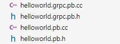
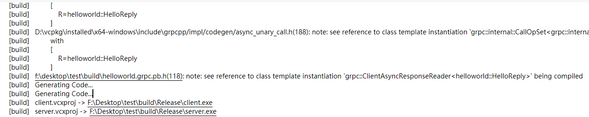

# Windows gRPC C++ Hello World Source
## Preface
When I was building gRPC C++ from gRPC source on the official website(here), it was very unfriendly to build it on windows, and finally I built successfully the gRPC project(spent a whole day to figure it, the whole project's dependencies are numerous and very complicated, so really hard you know@_@).
 
 But even if I build it successfully, I can't install gRPC into my project. There is less information about how to install it on windows step by step, all this is on Linux. So I google it and finally installed it into my project successfully by vcpkg. Here is my windows gRPC source code, which can build and run on my PC. It can also work with VS Code CMAKE.
## 1. Build and Install C++ gRPC on windows
#### (1) Install vcpkg
```cmd
> git clone https://github.com/microsoft/vcpkg
> cd vcpkg
> .\bootstrap-vcpkg.bat
# When build finished, Compiler will generate execute 'vcpkg.exe' in the current directory.
```

#### (2) Install gRPC
##### gRPC
```cmd
> vcpkg install grpc:x64-windows
# When finished, gRPC has been installed
```
##### proto
when you installed gRPC, proto should be installed too. And add  proto `"<vcpkg_install_path>/packages/protobuf_x64-windows/tools/protobuf"` to your environment path.

#### (3) Add gRPC to find directory

```cmd
> vcpkg integrate install
# When finished, CMake project can find gRPC from your disk
```

## 2. Install Visual Studio 2017
#### (1) Install [Visual Studio 2017 Community](https://visualstudio.microsoft.com/zh-hans/vs/community/) or other version


## 3. Add gRPC to your project
#### (1)Cmake
[CMakeLists.txt](CMakeLists.txt)
* When you add gRPC to your project, proto files should be in your project root directory. All the gRPC source files will be generated at your project root directory. 

* Of course, you can change the path if you have a basic understanding of CMake. If not and you want to learn CMake, you should check [here](https://sanoj.in/2020/04/09/an-introduction-to-cmake.html). 

#### (2) VS Code(need install [CMake](https://marketplace.visualstudio.com/items?itemName=twxs.cmake))
##### Config VS Code settings.json
```json
// .vscode/settings.json
{
  "cmake.configureSettings": {
    "CMAKE_TOOLCHAIN_FILE": "D:/vcpkg/scripts/buildsystems/vcpkg.cmake"
  }
}
```
##### Build and generate


#### (3) CMD
##### Build and generate
```cmd
> md build
> cd build
> cmake -G "Visual Studio 15 2017 Win64" ../ -DCMAKE_TOOLCHAIN_FILE=<vcpkg_install_path>/scripts/buildsystems/vcpkg.cmake
> cmake --build . --config Release --target ALL_BUILD
```

## 4. Run server and client
#### (1) Run Server
```cmd
> cd Release
> server.exe
Server listening on 0.0.0.0:50051
```

#### (2) Run Client
```cmd
> client
Greeter received: Hello world
```


## Reference
https://sanoj.in/2020/05/07/working-with-grpc-in-windows.html
https://grpc.io/docs/languages/cpp/quickstart/
https://github.com/microsoft/vcpkg
